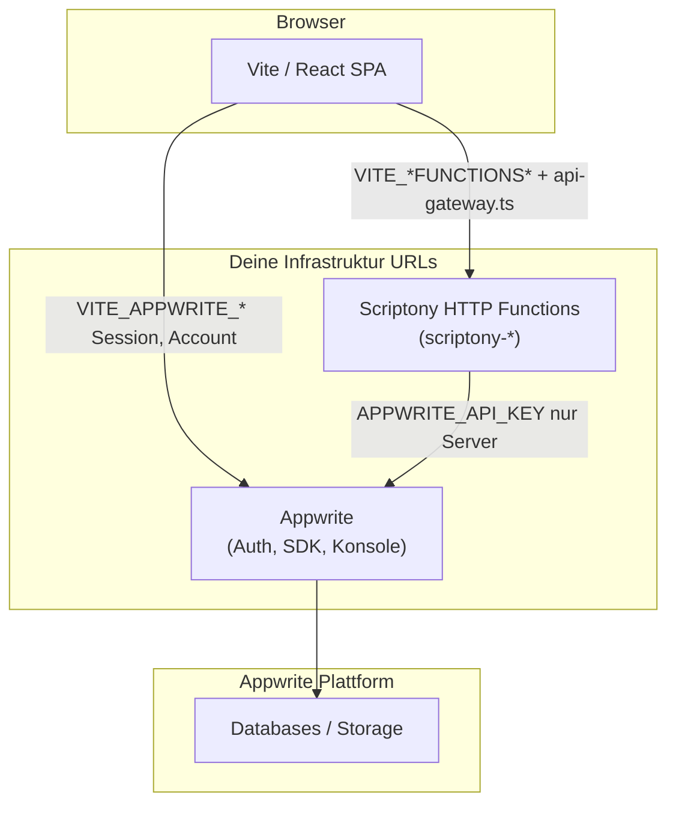

# Scriptony — Entwickler-Handbuch (Onboarding)

Dieses Dokument richtet sich an **neue Maintainer**: was das Repo tut, wie **Self-Hosting** zusammenhängt und wo sich welche Verantwortlichkeit befindet. Tiefe Einzeldetails stehen in den verlinkten Dateien.

**Kurzreferenz Architektur:** [SOURCE_OF_TRUTH.md](SOURCE_OF_TRUTH.md)  
**Self-Hosting Schrittfolge:** [SELF_HOSTING.md](SELF_HOSTING.md)  
**Docker (Appwrite lokal):** [../DOCKER_SETUP.md](../DOCKER_SETUP.md), [../infra/appwrite/README.md](../infra/appwrite/README.md)  
**Server / VPS-Rollout:** [SERVER_ROLLOUT.md](SERVER_ROLLOUT.md), [GITHUB_ACTIONS_DEPLOY.md](GITHUB_ACTIONS_DEPLOY.md)

---

## 1. Was Scriptony runtime ausmacht

| Schicht | Technik | Wer konfiguriert |
|--------|---------|------------------|
| **SPA (Browser)** | Vite + React (`src/`) | Build-Zeit: `VITE_*` in `.env.local` |
| **Identität / Appwrite-Plattform** | Appwrite SDK im Browser | `VITE_APPWRITE_*` → öffentlicher Endpoint + Projekt-ID (keine API-Keys im Client) |
| **App-Daten & Storage** | Appwrite Databases/Storage | Nur **serverseitig** aus `functions/*` mit API-Key |
| **HTTP-API der App** | Deployte Funktionen `scriptony-*` | Browser ruft eine **Basis-URL** + Funktionspfad auf (`src/lib/api-gateway.ts`) |

Der Browser spricht **niemals** direkt mit einer „Scriptony-Datenbank“ — nur mit **Appwrite** (Auth/SDK) und mit den **deployten HTTP-Functions**.

### Architektur (Diagramm)

---

## 2. Self-Hosted: typisches Zielbild

Alles läuft unter **deinen Domains** (oder localhost):

1. **Appwrite** (Docker auf VPS oder lokal via Root-`docker-compose.yml` → `infra/appwrite/`).
2. **Scriptony-Functions** (`functions/`), deployt auf Appwrite Functions oder einen Node-Host; CORS und öffentliche URL passend setzen.
3. **Frontend-Build** (`npm run build` → `build/`) auf nginx/Caddy o. Ä.; `VITE_*` zeigen auf deine Appwrite-URL und Functions-Basis-URL.

Konkrete Variablen und Beispiele: [SELF_HOSTING.md](SELF_HOSTING.md).

---

## 3. Prinzipien in diesem Repo (KISS, DRY, SOLID)

Diese Begriffe sind hier **konkret** gemeint, nicht als Buzzwords.

### KISS (Keep it simple)

- Eine klar erkennbare Trennung: **Konfiguration** (`src/lib/env.ts`, `functions/_shared/env.ts`), **Routing zum Backend** (`api-gateway.ts`), **Auth-Adapter** (`AppwriteAuthAdapter`), **Appwrite-Client** (`appwrite/client.ts`).
- Keine zweite „Wahrheit“ für dieselben URLs: Frontend liest `VITE_*` nur aus `env.ts`.

### DRY (Don’t repeat yourself)

- **Gleiche URL-Zusammenfügung** für Function-Base-URLs: `joinUrl` in `src/lib/env.ts` (von `api-gateway` genutzt).
- **Server-Env** zentral in `functions/_shared/env.ts` lesen, nicht in jedem Handler `process.env` duplizieren.

### SOLID (angewandt)

- **Single Responsibility:** `api-gateway.ts` entscheidet nur *welche* Function für einen Pfad zuständig ist; die Function selbst enthält die Fachlogik.
- **Open/Closed:** Neue API-Bereiche = neuer Eintrag in `ROUTE_MAP` + ggf. neuer Ordner unter `functions/`; bestehende Router-Struktur bleibt stabil.
- **Dependency Inversion:** UI und Features hängen an `AuthClient` (Interface) und `getAuthClient()`, nicht an einer konkreten Lucia-Implementierung — Produktivweg ist Appwrite.

---

## 4. Verzeichnis-Landkarte

| Pfad | Rolle |
|------|--------|
| `src/` | React-App, Komponenten, `lib/` (API, Auth, Env) |
| `src/lib/env.ts` | **Ein** Ort für öffentliche Frontend-Konfiguration (`VITE_*`) |
| `src/lib/appwrite/client.ts` | Singleton Appwrite SDK-Client (ohne Secret) |
| `src/lib/auth/` | `AuthClient`-Interface, `AppwriteAuthAdapter`, Factory `getAuthClient.ts` |
| `src/lib/api-gateway.ts` | Mappt Routen → `scriptony-*` Function-URLs |
| `functions/` | HTTP-Handler pro Domäne; gemeinsame Helfer in `functions/_shared/` |
| `functions/_shared/env.ts` | Server-only: `APPWRITE_*`, Buckets, keine Browser-Exports |
| `infra/appwrite/` | Vendortes Docker-Compose + `.env.example` für **lokalen** Appwrite-Stack |
| `docker-compose.yml` | Bindet `infra/appwrite` ein (Self-Host lokal) |
| `docker-compose.legacy.yml` | Optional: Postgres + Lucia — **nicht** der Appwrite-Produktionsweg |

---

## 5. Konfiguration: zwei getrennte Welten

| Ort | Variablen | Sichtbarkeit |
|-----|-----------|--------------|
| Frontend | `VITE_APPWRITE_*`, `VITE_*FUNCTIONS*`, Redirect-URLs | Im Build eingebettet — **öffentlich** |
| Functions | `APPWRITE_ENDPOINT`, `APPWRITE_API_KEY`, … | Nur Server/Container |

Vorlage Frontend: `.env.local.example`.  
Appwrite-Container: `infra/appwrite/.env` (aus `.env.example` kopieren).

---

## 6. Typische Aufgaben

| Aufgabe | Wo anfangen |
|---------|-------------|
| Auth-Flow / Session | `src/lib/auth/AppwriteAuthAdapter.ts`, Appwrite-Dashboard (Redirects) |
| Neue REST-Route für die SPA | `ROUTE_MAP` in `src/lib/api-gateway.ts` (Ausnahmen in `getBackendFunctionForRoute`) + Handler unter `functions/` |
| Datenmodell / Buckets | `functions/_shared/appwrite-db.ts`, `functions/_shared/env.ts` |
| Lokalen Appwrite starten | [../infra/appwrite/README.md](../infra/appwrite/README.md) |
| Env prüfen | `npm run verify:test-env` (Frontend) |

---

## 7. Tests & Qualität

- `npm run typecheck`, `npm run lint` — vor größeren Änderungen.
- Docker-Compose-Merge (CI): siehe `.github/workflows/ci.yml` (validiert eingebundenes Appwrite-Compose mit `.env.example`).

---

## 8. Glossar

- **Function (Scriptony):** Eigenständiger HTTP-Endpunkt unter `functions/scriptony-<name>/`, über eine gemeinsame Basis-URL erreichbar.
- **Appwrite Project ID:** Öffentlich im Client erlaubt; identifiziert das Projekt auf deiner Appwrite-Instanz.

Bei Unklarheiten zuerst [SOURCE_OF_TRUTH.md](SOURCE_OF_TRUTH.md) lesen, dann dieses Handbuch als Landkarte nutzen.
